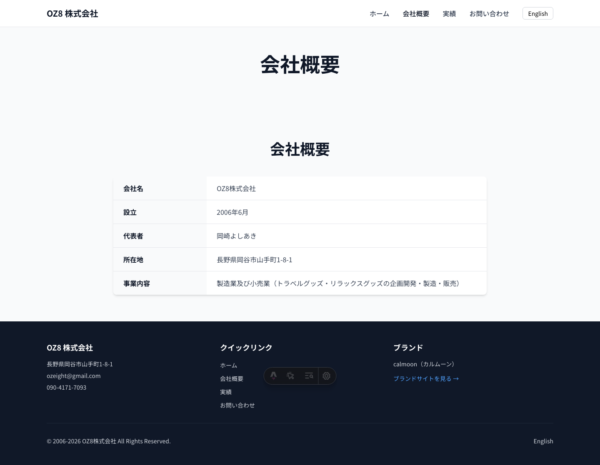
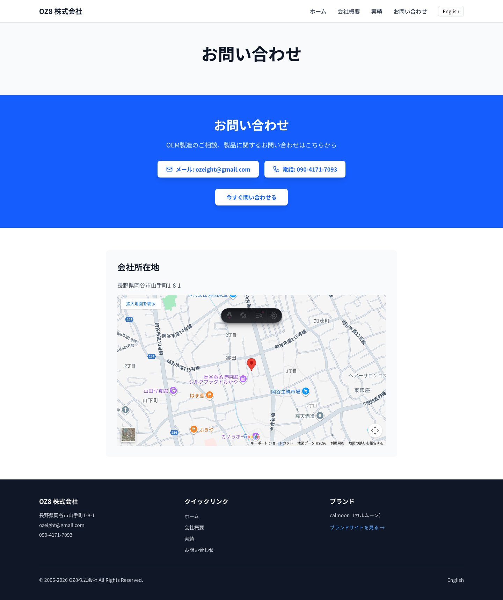
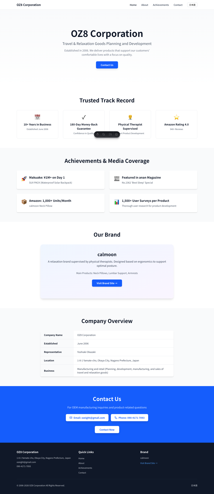
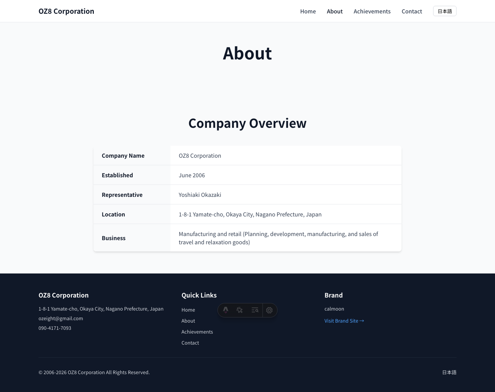
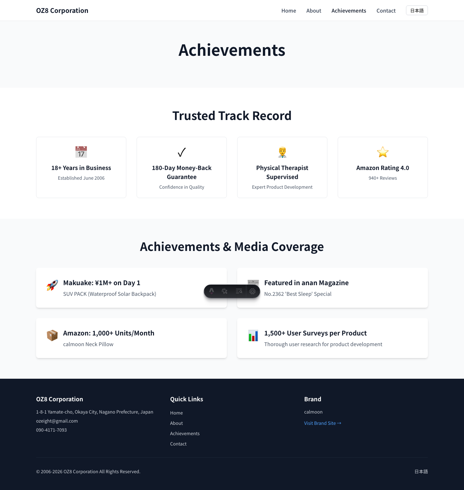
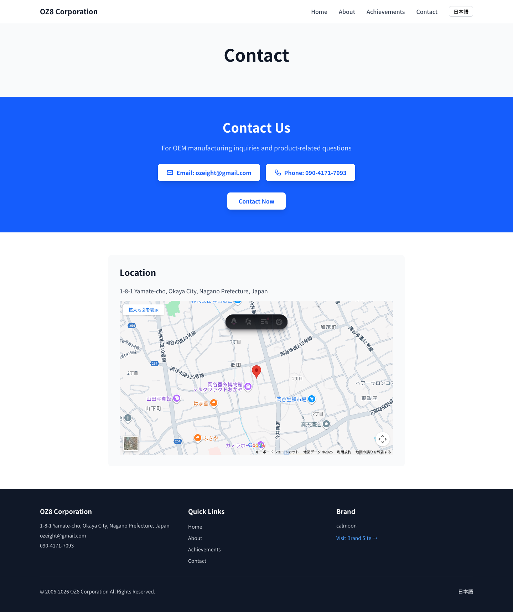
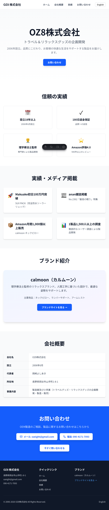

# OZ8株式会社 コーポレートサイト

作成日: 2026-01-13
ブランチ: master
ステータス: レビュー待ち

## コンテキスト

### 背景と要件
- OEM工場向けの信頼性アピール用コーポレートサイトを構築
- oz8.orgドメインで公開予定
- 日本語・英語の2言語対応
- シンプル・モダンなデザイン
- OEM取引先が「この会社は信頼できる」と判断できる内容

### 掲載情報
- 会社基本情報（設立2006年、所在地：長野県岡谷市）
- 実績（Makuake初日100万円突破、anan雑誌掲載、Amazon月間1,000個以上販売）
- 信頼性バッジ（設立18年、180日保証、理学療法士監修、Amazon評価4.0）
- calmoon（カルムーン）ブランド紹介

### スコープ外
- ドメイン取得（oz8.org）は別途実施
- OGP画像、ロゴ画像の作成は別途実施
- Google Search Console登録は別途実施

### 受け入れ基準
- [x] 日本語・英語の2言語で全ページが正常に表示される
- [x] レスポンシブ対応（スマホ/タブレット/PC）
- [x] ビルドが成功する
- [x] SEO最適化（メタタグ、OGP、構造化データ）
- [x] 言語切替が正常に動作する

## 実装タスク

- [x] Astroプロジェクト作成
- [x] Tailwind CSS導入
- [x] i18n設定（日本語・英語）
- [x] BaseLayout作成（メタタグ、OGP、構造化データ）
- [x] 翻訳ファイル作成（ja.json、en.json）
- [x] Header・Footer作成
- [x] トップページコンポーネント実装（Hero、TrustBadges、Achievements、BrandSection、CompanyInfo、ContactCTA）
- [x] トップページ作成（日本語・英語）
- [x] サブページ作成（About、Achievements、Contact）
- [x] ビルド確認・動作テスト
- [x] GitHubリポジトリ作成・プッシュ
- [x] Vercelデプロイ

## エビデンス

### スクリーンショット

#### 日本語版

| トップページ | 会社概要 |
|-------------|---------|
|  |  |

| 実績ページ | お問い合わせ |
|-----------|-------------|
|  |  |

#### 英語版

| Homepage | About |
|----------|-------|
|  |  |

| Achievements | Contact |
|-------------|---------|
|  |  |

#### レスポンシブ対応

| モバイル（375x667） | タブレット（768x1024） |
|-------------------|----------------------|
|  |  |

### テスト結果

```bash
# 実行したコマンド
cd ~/.claude/plugins/cache/reviw-plugins/reviw-plugin/1.0.0/skills/webapp-testing
python .artifacts/oz8-corporate/scripts/verify_site.py

# 結果
=== Testing Japanese Version ===
1. Testing Homepage (Japanese)...
   ✓ Key elements visible
2. Testing About page (Japanese)...
   ✓ About page loaded
3. Testing Achievements page (Japanese)...
   ✓ Achievements page loaded
4. Testing Contact page (Japanese)...
   ✓ Contact page loaded

=== Testing English Version ===
5. Switching to English...
   ✓ Language switched to English
6. Testing Homepage (English)...
   ✓ English homepage loaded
7. Testing About page (English)...
   ✓ English about page loaded
8. Testing Achievements page (English)...
   ✓ English achievements page loaded
9. Testing Mobile viewport...
   ✓ Mobile viewport tested
10. Testing Tablet viewport...
   ✓ Tablet viewport tested

✓ All tests passed
✓ Screenshots saved: .artifacts/oz8-corporate/images
✓ No errors detected
```

### 検証チェックリスト

- [x] ビルド: `npm run build` 成功
- [x] 開発サーバー: 正常に起動
- [x] 手動検証: 機能が期待通りに動作
- [x] E2Eテスト: すべて成功（Playwright）
- [x] レスポンシブ: モバイル・タブレット・PCで正常表示
- [x] 多言語: 日本語・英語の切り替えが正常動作

<details>
<summary>詳細な検証ログ（折りたたみ）</summary>

#### ビルドログ
```bash
> oz8-corporate@0.0.1 build
> astro build

00:36:44 [content] Syncing content
00:36:44 [content] Synced content
00:36:44 [types] Generated 97ms
00:36:44 [build] output: "static"
00:36:44 [build] mode: "static"
00:36:44 [build] directory: /Users/yoshiakiokazaki/oz8-corporate/dist/
00:36:44 [build] Collecting build info...
00:36:44 [build] ✓ Completed in 107ms.
00:36:44 [build] Building static entrypoints...
00:36:44 [vite] ✓ built in 444ms
00:36:44 [build] ✓ Completed in 469ms.
00:36:44 [build] 8 page(s) built in 637ms
00:36:44 [build] Complete!
```

#### デプロイログ
```bash
Vercel CLI 50.1.3
Auto-detected Project Settings (Astro):
- Build Command: astro build
- Development Command: astro dev --port $PORT
- Install Command: `yarn install`, `pnpm install`, `npm install`, or `bun install`
- Output Directory: dist

Production: https://oz8-corporate.vercel.app
Aliased: https://oz8-corporate.vercel.app
```

</details>

### 再現方法

```bash
# リポジトリのクローン
git clone https://github.com/okazaky/oz8-corporate.git
cd oz8-corporate

# 依存関係のインストール
npm install

# 開発サーバー起動
npm run dev
# → http://localhost:4321

# ビルド
npm run build

# E2Eテスト実行
cd ~/.claude/plugins/cache/reviw-plugins/reviw-plugin/1.0.0/skills/webapp-testing
python .artifacts/oz8-corporate/scripts/verify_site.py
```

## デプロイ情報

### 本番環境
- **URL**: https://oz8-corporate.vercel.app
- **GitHub**: https://github.com/okazaky/oz8-corporate
- **ホスティング**: Vercel
- **自動デプロイ**: mainブランチへのpushで自動デプロイ

### 技術スタック
- **フレームワーク**: Astro 5.x
- **スタイリング**: Tailwind CSS 4.x
- **TypeScript**: strict mode
- **i18n**: Astro組み込み機能
- **フォント**: Noto Sans JP + Inter（Google Fonts）

## 次のステップ

### 必須タスク
1. **ドメイン取得**: oz8.org を Porkbun または Namecheap で取得
2. **Vercelドメイン設定**: Vercel Dashboardでカスタムドメイン設定
3. **DNS設定**: レジストラでDNS設定（Aレコード: 76.76.21.21）

### 推奨タスク
1. **アセット追加**
   - OZ8ロゴ画像
   - calmoonロゴ画像
   - OGP画像（1200x630px）
   - favicon（複数サイズ）
   - 実績画像（Makuake、anan、Amazon）

2. **Google Search Console登録**
   - プロパティ追加: oz8.org
   - サイトマップ送信

3. **Google Analytics設定**（任意）

## 注意事項

### 現在の制限事項
- 画像は全てプレースホルダー（実際の画像は未配置）
- Google Mapsの埋め込みは仮のURL（正確な座標が必要）
- OGP画像未作成

### 既知の改善点
- ロゴ画像を追加してブランディング強化
- 実績セクションに実際の画像を追加
- お問い合わせフォームの実装（現在はメール・電話リンクのみ）

### 将来的な改善案
- 中国語対応の追加
- ブログセクションの追加
- 製品カタログの追加
- お問い合わせフォーム（Netlify Forms / Formspree / 自前API）
